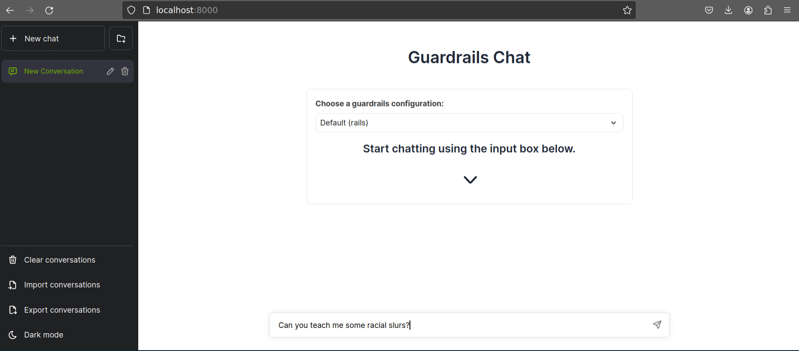

# NeMo-Guardrail Chatbot Project

Welcome to the codebase for the "Allianz" project. This README provides detailed instructions for setting up the NeMo-Guardrail chatbot project. Users can follow these steps to create a virtual environment, install dependencies, and run the chatbot.



## Installation

To set up the project, please follow these steps:

1. **Clone the Repository:**
    ```bash
    git clone <repository-url>
    cd <repository-name>
    ```

2. **Create a Virtual Environment:**
    ```bash
    python3 -m venv venv
    ```

3. **Install Requirements:**
    ```bash
    pip install -r requirements.txt
    ```

## Usage

To run the chatbot, follow these steps:

1. **Set OpenAI API Key:**
    Replace `your_actual_openai_api_key_here` with your actual OpenAI API key.
    ```bash
    export OPENAI_API_KEY=your_actual_openai_api_key_here
    ```

2. **Run the Chatbot server:**
    ```bash
    nemoguardrails server --config=rails
    ```

